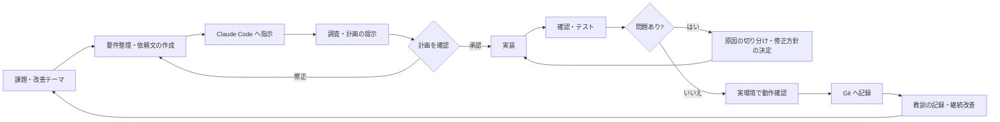

# Youhei Suzuki — AI-Assisted Development Portfolio

> 個人開発の成果物を、AI コーディングエージェント（主に Claude Code）を活用した開発プロセスとあわせて紹介する採用向けポートフォリオです。
> ソースコードの配布が目的ではないため、各プロジェクトは概要・構成図・工夫した点を中心にまとめています。

## 1. 概要

本業のかたわら、動画の自動生成 bot、家庭向けの学習アプリ、実店舗で使う業務アプリなどを個人で開発・運用しています。
開発では Claude Code を「開発エージェント」として使い、調査・設計検討・実装・デバッグを任せる一方で、何を作るか、どの案を採用するか、実環境で正しく動いているかの判断は自分で行っています。

このリポジトリは、その成果物と進め方を採用担当者・エンジニアの方が 5 分程度で把握できることを目標にしています。
元のリポジトリはすべて Private のままで、ここには秘密情報・個人情報・実運用データを含まない説明資料だけを新規に作成しています。

## 2. プロジェクト一覧

| プロジェクト | 一言説明 | 主な技術 | 状態 | 詳細 |
|---|---|---|---|---|
| YouTube Shorts Automation | テーマ選定から台本生成・検証・レンダリングまでを毎日自動で行う縦動画生成パイプライン | Remotion / React / TypeScript / Python / Claude API | 運用中（投稿は手動） | [詳細](projects/youtube-shorts-automation/README.md) |
| Instagram Reel Bots | 5 アカウント分のリール動画を共通アーキテクチャで毎日生成する bot 群 | Python / FFmpeg / Claude API | 運用中（投稿は手動） | [詳細](projects/instagram-reel-bots/README.md) |
| AI Home Tutor | 小学生向けのブラウザ家庭教師アプリ（英語が主教科、算数は補助） | Python / FastAPI / Claude API | 運用中（家族向け） | [詳細](projects/ai-home-tutor/README.md) |
| Grooming Salon Manager | 家族が営む実店舗のトリミングサロンで使う顧客・予約・カルテ・売上管理 PWA | React / TypeScript / Firebase | 運用中（実店舗で日常利用） | [詳細](projects/grooming-salon-manager/README.md) |

## 3. 開発スタイル — AI エージェントとの協働

AI エージェントに任せている部分と、自分で担当・判断している部分を分けて運用しています。

| AI エージェント（Claude Code）に任せている部分 | 自分が担当・判断している部分 |
|---|---|
| 技術調査、実現方法の検討、設計検討 | 何を作るか、どの機能が必要か、仕様 |
| 既存コードの解析、コード生成、複数ファイルにまたがる実装 | AI への指示（依頼文の作成、制約と停止条件の指定） |
| 修正、エラー原因の調査、デバッグ、リファクタリング | 生成結果の確認、問題の原因の切り分け、修正方針の採用 |
| テストコードの作成、ドキュメント整備 | 実環境での動作確認、最終的な採用判断、継続改善 |

「AI が全部作った」わけでも「すべて手書きした」わけでもなく、AI に実装を委ねつつ、判断と検証を自分が持つ形で進めています。
各プロジェクトには CLAUDE.md（プロジェクト固有の構成・設計判断・運用ルール）と作業記録（計画・教訓）を置き、毎回ゼロから指示するのではなく、ルールを積み上げながら開発しています。

詳細: [docs/ai-development-workflow.md](docs/ai-development-workflow.md)

## 4. 共通の開発フロー

## 5. 技術スタック（全体）

（フェーズ5で全プロジェクト分を確定）

| 分類 | 技術 |
|---|---|
| 言語 | Python、TypeScript |
| フロントエンド・動画 | React、Remotion |
| AI / API | Claude API（Anthropic）、Pexels API、YouTube Analytics API |
| メディア処理 | FFmpeg、VOICEVOX |
| 自動実行・通知 | launchd（macOS）、Slack API |
| テスト | unittest（Python） |
| 開発ツール | Git / GitHub、Claude Code |

## 6. セキュリティ・プライバシーへの配慮

- 認証情報は `.env` などリポジトリ管理外のファイルに置き、`.gitignore` で除外しています。
- 開発中の元リポジトリは Private のまま維持し、このポートフォリオは Git 履歴を引き継がない新規リポジトリとして作成しています。
- 公開前にキーワード検索・ファイル種別・画像の目視でチェックし、個人情報・実運用データ・秘密情報を含めていません。

詳細: [docs/security-and-privacy.md](docs/security-and-privacy.md)

## 7. このポートフォリオで伝えたいこと

（フェーズ5で確定）

- AI コーディングエージェントを、日常の開発で実際に使いこなしていること
- AI に任せる範囲と自分が判断する範囲を分け、生成結果を検証してから採用していること
- 動くものを複数作り、一部は毎日の定時実行や実店舗での利用として運用し続けていること
- 障害や失敗を教訓として記録し、ルールとして次の開発に反映していること

## 8. 業務での取り組み

本業では製造業の社内SEとして、レガシーWebシステムの移行、コーポレートサイトの再構築、検査・帳票業務の自動化などを担当しています。詳細は職務経歴書でご説明します。

## English Summary

（フェーズ5で確定）

This repository is a recruiting portfolio that presents my personal projects together with how I build them using AI coding agents, mainly Claude Code.
The projects include a daily YouTube Shorts generation pipeline (Remotion / Python / Claude API), a set of Instagram Reel bots sharing one architecture, a browser-based home tutor app for elementary school students, and a PWA used daily in a real grooming salon.
I delegate research, design exploration, implementation, and debugging to the agent, while I own the requirements, the instructions, verification in the real environment, and the final decisions.
Each project keeps its own CLAUDE.md and a record of plans and lessons, so the agent works under accumulated project rules rather than ad-hoc prompts.
The original repositories remain private; this repository contains only newly written documentation with no secrets, personal data, or production data.

---

本リポジトリの文章・図・画像の無断転載はご遠慮ください。All rights reserved.
