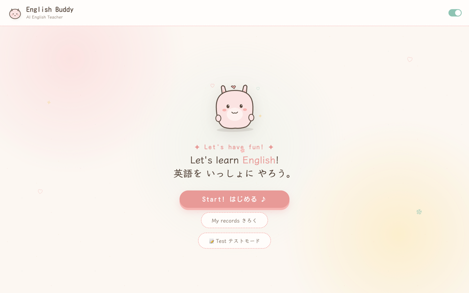
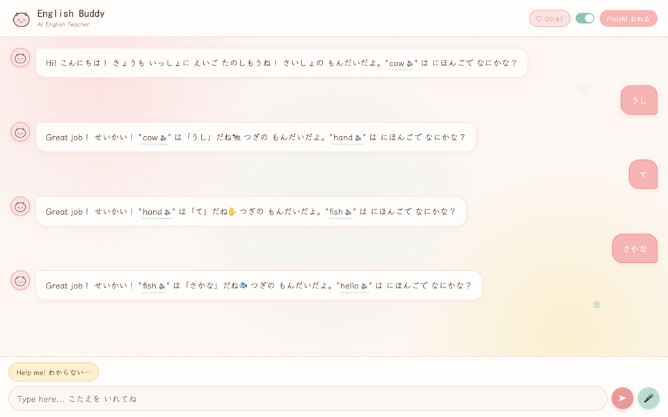
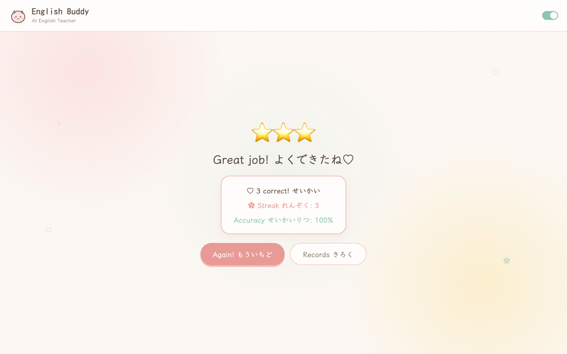
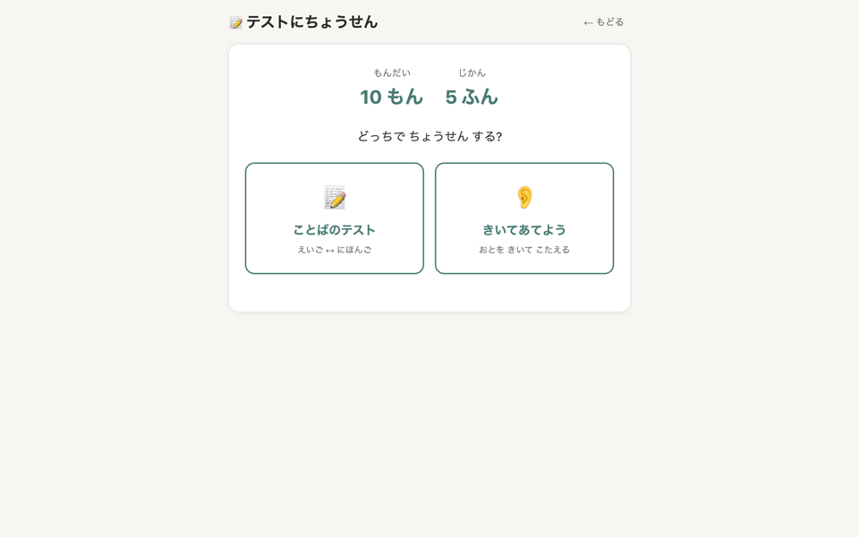
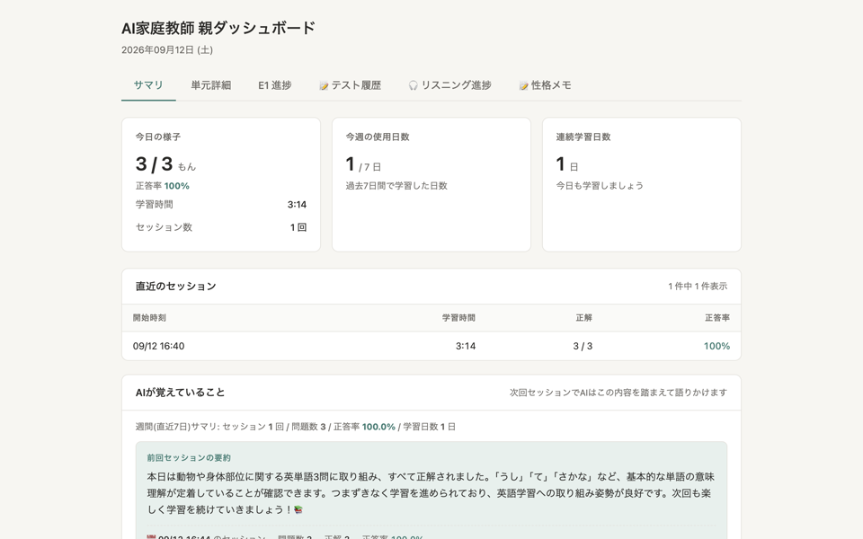
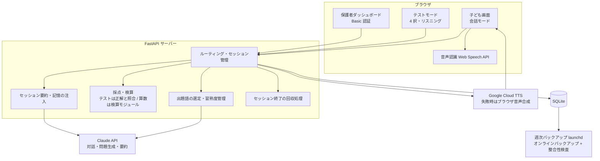

# AI Home Tutor（AI 家庭教師）

小学生向けのブラウザ家庭教師アプリです。英語を主教科、算数を補助モードとして、音声での会話練習・語彙テスト・学習記録の可視化を 1 つのアプリにまとめています。
家族向けに開発し、日常的に使いながら改善を続けています。

| 項目 | 内容 |
|---|---|
| 状態 | 運用中（2026 年 3 月開発開始。家庭内の PC でローカルに起動して家族が日常利用。週次の自動バックアップを稼働） |
| 種別 | ブラウザ学習アプリ（Python / FastAPI / Claude API） |
| 公開範囲 | 本ページは概要・構成・工夫点の説明のみ。ソースコード・学習データは非公開 |

  
  

  
  

  

上の画像は英語モードの画面です（開始、会話、結果、テストモードの選択、保護者ダッシュボードのサマリー）。画面上のアプリ名は開発時の愛称、データはダミーです。

## 1. 概要

子どもがブラウザを開き、AI と英語で話したり、語彙の 4 択やリスニングのテストを受けたりできるアプリです。
音声の読み上げと音声入力に対応しているため、キーボード入力に慣れていない子どもでも使えます。
保護者は別画面（ダッシュボード）から、正答率・学習時間・連続学習日数・単元ごとの習熟度・テスト履歴を確認できます。
アプリは家庭内の PC でローカルに起動して使うもので、インターネット上には公開していません。

当初は算数を主教科として開発しましたが、AI（大規模言語モデル）は計算の正確さが弱く、英会話の練習相手としては強いことから、2026 年 4 月に主教科を英語へ転換しました。算数は削除せず「文章題の考え方を相談するコーチ」の位置づけで補助モードとして残しています。

## 2. 解決したかった課題

- 家庭で英語を話す練習相手がいない。恥ずかしがらずに何度でも間違えられる相手を用意したい
- AI に出題や採点を丸ごと任せると、記録がずれたり計算を間違えたりする。正誤の判定と記録はアプリ側で管理したい
- 子どもの学習状況を、保護者が会話ログを読まずに把握できるようにしたい
- 子どもが途中でブラウザを閉じても、その回の学習記録が消えないようにしたい
- 学習履歴が入ったデータベースを、安全にバックアップし続けたい

## 3. 主な機能（実装済み）

- **英語の会話モード**: 出題する単語をアプリ側が選び、AI がその単語を使った対話を進める。音声読み上げ（クラウド TTS、失敗時はブラウザ標準の音声合成に切り替え）と音声入力（ブラウザ標準の音声認識）に対応
- **テストモード**: 語彙の 4 択問題とリスニング問題。問題は AI が生成し、リスニング問題は生成後に別の呼び出しで検証してから使う（最大 3 回まで再生成）。採点はアプリ側が保存済みの正解と照合して行う
- **算数モード（補助）**: 環境設定で切り替え。AI の回答に含まれる計算をアプリ側の検算モジュールで独立に検証し、誤りを検出・補正する
- **習熟度と難易度の管理**: 単語ごとの習熟度を記録し、条件を満たすと次の難易度を解放する。次に出す単語は習熟度をもとにアプリ側が決める
- **セッションの記憶**: 各回の要約をコストの低いモデルで作成し、次回の対話に引き継ぐ
- **保護者ダッシュボード**（Basic 認証）: サマリー（正答率・学習時間・セッション数・連続学習日数）、単元詳細、テスト履歴、習熟度と難易度解放の状況を Chart.js のグラフとテーブルで表示
- **保護者による性格メモ**: 保護者が子どもの興味や配慮事項をメモとして入力でき、AI が対話のたびに参照する（子どもの画面には表示しない）
- **セッションの確実な終了**: 「おわり」ボタンに加え、ページを離れる際の送信と、起動時に未終了セッションを回収する処理の三段構えで記録の消失を防ぐ
- **自動バックアップ**: SQLite のオンラインバックアップ機能で稼働中でも整合性のあるコピーを取り、整合性検査に通ったものだけ世代管理する。launchd で週 1 回実行

## 4. 技術スタック

| 分類 | 技術 |
|---|---|
| バックエンド | Python 3.11+、FastAPI、uvicorn |
| データベース | SQLite |
| AI | Claude API（Anthropic）: 対話生成、セッション要約、テスト問題の生成と検証 |
| 音声 | Google Cloud Text-to-Speech、Web Speech API（ブラウザ標準の音声認識・合成） |
| フロントエンド | HTML / CSS / JavaScript（フレームワーク不使用）、Chart.js |
| テスト | pytest（23 ファイル）、Node.js による音声配線チェック |
| 運用 | launchd（macOS）、シェルスクリプト（バックアップ） |
| 認証 | Basic 認証（保護者画面の切り分け用。家庭内のローカル利用） |

## 5. Claude Code の活用方法

- **設計ルールの復唱**: CLAUDE.md の冒頭に「作業開始時に設計上の重要ルールを復唱してから着手する」と書き、出題語の決定権はサーバー側にある、セッション終了は三段構え、といった壊してはいけない設計をエージェントに毎回確認させています
- **監査 ID 単位のコミット**: 自己監査で見つかった所見に ID を振り、所見ごとに修正・実機検証・コミットを行う運用にしています。push 後に HEAD の一致を確認するルールも CLAUDE.md に記載しています
- **反証型のレビュー**: 重要な変更では「修正が効いていることを読み戻すアサーション」と、わざとコードを壊してテストが落ちることを確かめる手順を経てからコミットするルールを教訓として定めました
- **教訓の蓄積**: 「LLM が生成する対話状態はサーバーが決めて明示指示する」「テストは通るが実機で動かないときは推測せず観察する」「モックのテストは外部 API の挙動を検証できない」など、障害から得たルールを記録し、以降の依頼文と CLAUDE.md に反映しています
- **教科転換の意思決定を文書化**: 主教科を英語に転換する判断では、複数の AI に同じ相談をして結論を比較し、技術面・教育面・運用面の根拠とともに決定文書として残しました
- **引き継ぎ文書と完了報告**: フェーズごとの計画（1,700 行超）、監査レポート、セッションの引き継ぎ文書を Claude Code とともに作成し、作業を中断・再開しても文脈が失われないようにしています

## 6. システム構成

詳細は [docs/architecture.md](docs/architecture.md) を参照してください。

## 7. 開発で工夫した点

- **AI に任せない部分を決める**: 出題する単語はアプリ側が習熟度から選び、AI には「この単語で対話する」と明示します。以前は AI に単語の選択を任せており、回答の多くが別の単語として記録される不具合が起きたため、「対話の状態はサーバーが決めて指示する」設計に改めました
- **採点と検算をアプリ側で持つ**: テストの採点は保存済みの正解と照合して行い、算数モードでは AI の計算を独立した検算モジュールで検証します
- **生成した問題を別の呼び出しで検証する**: リスニング問題では同音異義語などの不適切な問題が混ざるため、生成と検証を分けて、通らなければ再生成します
- **記録が消えない終了処理**: 「おわり」ボタン、ページ離脱時の送信、起動時の未終了セッションの回収を組み合わせ、子どもがブラウザを閉じても記録が残るようにしました
- **記憶注入の自己参照バグの修正**: 進行中のセッション自身が統計に混ざる不具合を見つけ、スナップショット方式に改めました
- **安全なバックアップ**: ファイルコピーではなく SQLite のオンラインバックアップを使い、整合性検査に通ったものだけを世代管理します
- **テストで本番データを汚さない**: テスト実行時はデータベースのパスを一時ファイルに差し替え、実際の学習記録に触れない構成にしています
- **保護者主導の個別化**: 子どもの性格を AI に推定させるのではなく、保護者が入力したメモを AI が参照する方式にし、仕組みを単純に保ちました

## 8. Demo

画面の様子は上記スクリーンショットを参照してください。

## 9. このプロジェクトで得たこと

- 「AI に何を任せ、何をアプリ側で決めるか」の線引きが、記録の正確さと信頼性を左右すること
- 子どもという利用者を想定し、途中で閉じる・言い間違える・待てない、といった行動を前提にした設計の重要性
- 主教科の転換のような大きな判断を、複数の情報源で裏を取り、根拠とともに文書化して決める進め方
- 実機で動かして初めて分かる不具合（音声の重なり、クラウド音声の仕様）に対し、推測ではなく観察で原因を特定する習慣
- 監査 → 修正 → 実機検証 → コミットの単位を小さく保つことで、Claude Code との長期の開発でも品質を維持できること
