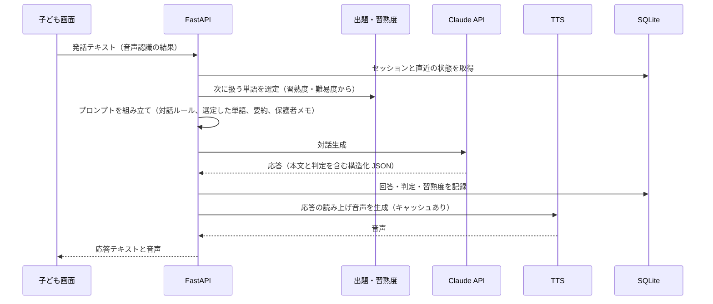
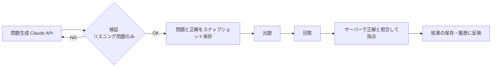

# AI Home Tutor — システム構成

README の構成図をもう一段詳しく説明します。利用者に関する情報・学習データ・認証情報は記載していません。

## 1. コンポーネント

| レイヤー | 役割 | 実装 |
|---|---|---|
| 子ども画面 | 会話モードの UI、音声入力、読み上げの再生 | HTML / CSS / JavaScript（単一ファイル）、Web Speech API |
| テスト画面 | 語彙 4 択・リスニング問題の出題と回答 | 同上 |
| 保護者画面 | 学習記録の可視化、性格メモの入力 | 同上 + Chart.js、Basic 認証 |
| API サーバー | ルーティング、セッション管理、プロンプトの組み立て、採点 | FastAPI + uvicorn |
| 出題・習熟度 | 次に出す単語の選定、習熟度の更新、難易度の解放 | Python モジュール |
| 採点・検算 | テストの照合採点、算数の検算 | Python モジュール |
| 記憶 | セッション要約の生成と次回への注入 | Python モジュール + Claude API |
| 問題生成 | テスト問題の生成と検証 | Python モジュール + Claude API |
| 音声合成 | 日本語・英語の読み上げ、テキストの正規化、キャッシュ | Google Cloud TTS（失敗時はブラウザ音声合成） |
| データ | セッション、回答、習熟度、テスト、要約、性格メモ | SQLite |
| バックアップ | 稼働中のオンラインバックアップ、整合性検査、世代管理 | シェルスクリプト + launchd（週 1 回） |

## 2. 会話モードの 1 ターン

- 単語の選定を AI に任せず、サーバーが決めてプロンプトで明示する。これにより、AI が別の単語で対話を進めて記録がずれる問題を防ぐ
- 会話モードでの正誤判定は AI の応答に含まれる判定を採用し、記録のキー（どの単語か）はサーバー側で固定する
- 算数モードでは、AI の応答に含まれる計算を検算モジュールで独立に検証する

## 3. テストモード

- 問題の生成時に正解を保存し、採点はその保存済みの正解と回答を照合して行う（AI に採点させない）
- リスニング問題は同音異義語などが混ざるため、生成後に別の呼び出しで検証し、通らなければ最大 3 回まで再生成する
- 送信に失敗した場合は再試行の画面に誘導し、誤った 0 点の結果を作らない

## 4. セッションの確実な終了

| 手段 | 役割 |
|---|---|
| 「おわり」ボタン | 通常の終了。要約を生成して保存 |
| ページ離脱時の送信 | ブラウザを閉じた・戻ったときに終了を通知 |
| 起動時の回収 | サーバー起動時に未終了のセッションを検出して確定 |

## 5. 記憶と個別化

- 各セッションの要約をコストの低いモデルで生成し、次回の対話プロンプトに注入する
- 進行中のセッション自身が統計に混ざらないよう、要約に使う統計はセッション開始時のスナップショットから作る
- 保護者が入力した性格メモを AI が毎回参照する。AI による性格の自動推定は採用せず、保護者主導の方式にしている

## 6. データ保護と運用

- 環境ファイル（API キー、保護者画面の認証情報、モード設定、クラウド認証ファイルの場所）は Git 管理外。リポジトリには変数名だけのサンプルを置く
- 学習データ（データベース、履歴、音声キャッシュ、バックアップ）は Git 管理外
- バックアップは SQLite のオンラインバックアップ機能で取得し、整合性検査に通ったものだけを保持（7 世代）。launchd で週 1 回実行
- テストは一時的なデータベースパスに差し替えて実行し、実データに触れない

## 7. テストと記録

- pytest 23 ファイル（リスニングモード、テストセッション、習熟度、記憶注入、TTS の正規化など）と、音声の配線を確認する Node.js スクリプト
- 教訓ファイルに「サーバー側検算の設計パターン」「テストは通るが実機で動かないときは観察する」「モックは外部 API の挙動を検証できない」などを記録
- 監査レポート、フェーズ完了報告、引き継ぎ文書を docs に保存
- コミット数 94（2026 年 3 月〜9 月）、ブランチは main のみ
