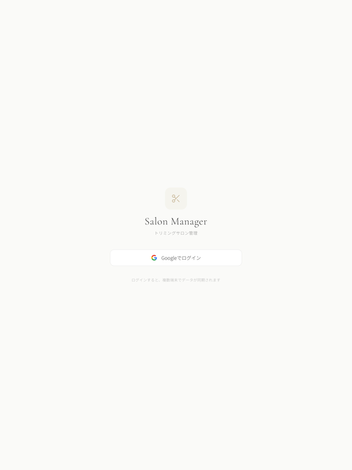
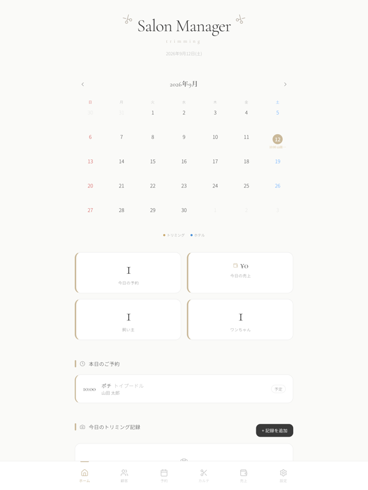
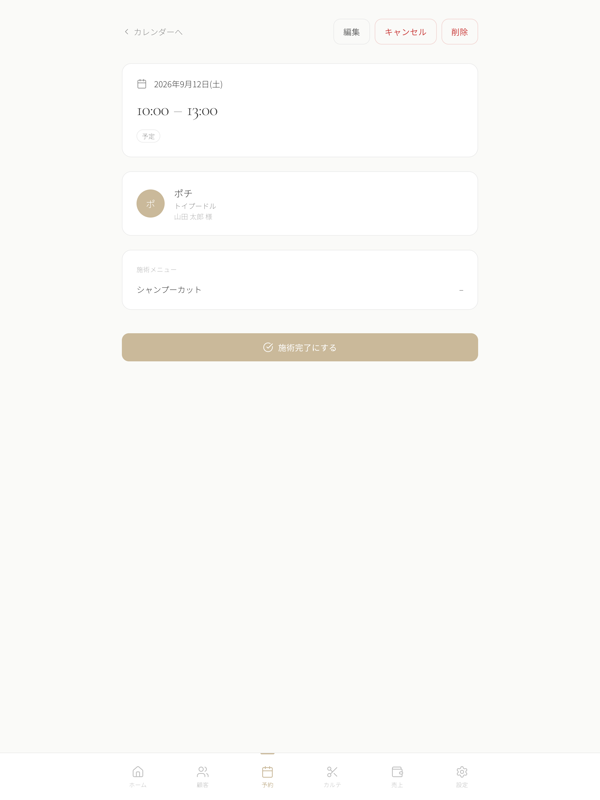
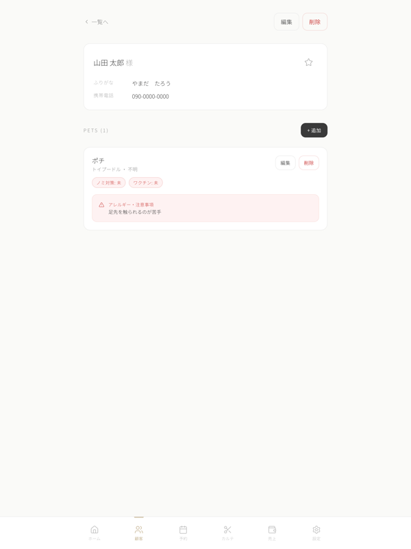
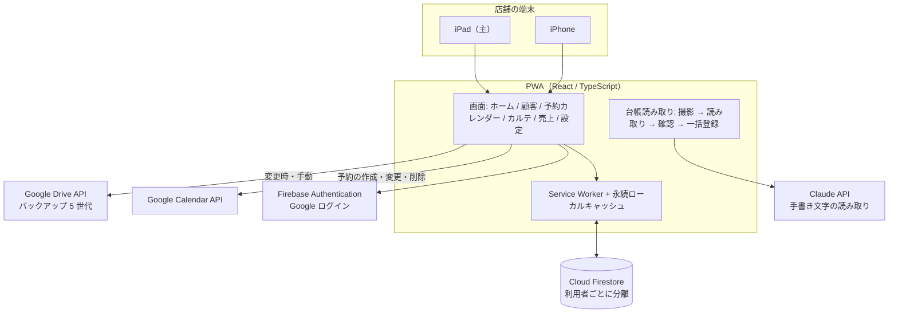

# Grooming Salon Manager

家族が営む実店舗のトリミングサロンで日常的に使っている、顧客・予約・カルテ・売上を管理する PWA（ブラウザで動くアプリ）です。
iPad を主な端末として、紙の台帳と手書きの予約表をアプリに置き換えました。

| 項目 | 内容 |
|---|---|
| 状態 | 運用中（2026 年 3 月開発開始、実店舗で日常利用） |
| 種別 | 業務アプリ / PWA（React / TypeScript / Firebase） |
| 公開範囲 | 本ページは概要・構成・工夫点の説明のみ。ソースコード・店舗情報・顧客データは非公開 |

  
  

  
  

上の画像は iPad 向けの画面です（左上: ログイン、右上: ホーム、左下: 予約詳細、右下: 顧客詳細）。画面上の店名は撮影用の仮の名称、データはダミーです。

## 1. 概要

トリミングサロンでは、飼い主とペットの情報、予約、施術の記録、売上が紙の台帳や手書きの表に分かれがちです。
このアプリは、それらを 1 つの画面から扱えるようにしたものです。
飼い主とペットを登録し、カレンダーで予約を取り、施術後にカルテと写真を残すと、売上が自動で記録されます。
データはクラウド（Firestore）に保存され、iPad と iPhone のどちらからでも同じ内容を見られます。

紙の顧客台帳は、iPad のカメラで撮影すると AI（Claude API）が手書き文字を読み取り、確認してから一括登録できます。
予約は Google カレンダーにも自動で反映され、データは Google Drive に世代管理でバックアップされます。

## 2. 解決したかった課題

- 紙の台帳・予約表・売上帳が分かれていて、同じ情報を何度も書き写していた
- 過去に登録した紙の顧客台帳を、手入力なしでアプリに移したい
- 予約の重複や、犬種とメニューごとの料金計算のミスを減らしたい
- 店の iPad と外出先の iPhone で同じデータを見られるようにしたい
- 端末の故障や誤操作でデータを失わないよう、バックアップを自動化したい
- 通信が不安定でも、閲覧と入力が止まらないようにしたい

## 3. 主な機能（実装済み）

- **顧客管理**: 飼い主とペットの登録・編集・検索（氏名・電話番号・ペット名・犬種）。ペットは基本情報、健康・医療情報、トリミング時の注意事項をセクション分けして管理
- **予約管理**: 月・週・日のカレンダー表示（スワイプ操作対応）。飼い主 → ペット → メニューの順に選ぶフォーム、犬種×メニューによる料金と所要時間の自動計算、同時間帯の重複チェック、トリミング・ペットホテル・セットの予約種別、ステータス管理（予定 → 完了 / キャンセル）
- **施術カルテ**: 使用したシャンプーやカットスタイル、皮膚の状態、申し送りを記録。ビフォーアフター写真の撮影・プレビュー、過去入力からのサジェスト、ペット別の施術履歴表示。予約完了時にカルテ作成へ誘導し、カルテ作成時に売上を自動記録
- **売上管理**: 日別・月別の一覧、月間サマリー（合計・件数・平均客単価）、支払方法の管理、売上の修正
- **料金マスタ**: メニュー（基本コース / オプション）と犬種別の料金・所要時間の設定
- **紙台帳の AI 読み取り**: iPad カメラで撮影した紙の顧客台帳を Claude API で読み取り、読めなかった文字をハイライトした状態で確認・修正し、同名の飼い主がいれば警告したうえで一括登録
- **Google カレンダー連携**: 予約の作成・変更・キャンセルに応じてカレンダーのイベントを自動で作成・更新・削除
- **Google Drive バックアップ**: データ変更時の自動バックアップと手動バックアップ・復元（最大 5 世代を保持）
- **PWA・オフライン対応**: ホーム画面に追加して全画面で利用。Firestore のローカルキャッシュを永続化し、通信が不安定でも閲覧・入力できる
- **ホーム画面**: 今日の予約、次の予約までのカウントダウン、今日の売上合計、今日の施術記録
- **認証**: Google アカウントによるログイン。データは利用者ごとに分離して保存

## 4. 技術スタック

| 分類 | 技術 |
|---|---|
| フロントエンド | React 19、TypeScript、Vite、react-router |
| スタイリング | Tailwind CSS v4、lucide-react、Noto Sans JP / Cormorant Garamond |
| バックエンド（BaaS） | Firebase Authentication、Cloud Firestore（永続ローカルキャッシュ） |
| PWA | vite-plugin-pwa（Service Worker、マニフェスト） |
| 外部連携 | Google Identity Services（OAuth）、Google Calendar API、Google Drive API |
| AI | Claude API（Anthropic）: 手書き台帳の読み取り |
| 品質 | TypeScript の型チェック、npm audit、7 観点の並列監査 |
| 移行 | Dexie.js（IndexedDB。初期のローカル DB からの移行用に残存） |

## 5. Claude Code の活用方法

- **利用者の要望から画面を作る**: 店で実際に使う家族の要望（ペットの注意事項を分けて表示したい、予約完了からカルテ作成へすぐ進みたい、など）を整理して依頼文にし、Claude Code に画面とデータ構造の実装を任せ、iPad Safari の実機で確認してから取り入れています
- **7 観点の並列監査**: 運用開始後、読み取り専用のサブエージェントに 7 つの観点で並列に監査させ、すべての所見を独立の検証役がコードと突き合わせて確認し、監査漏れの完全性チェックまで行う手順を取りました。確定した 54 件の所見を高 7 件・中 19 件・低 11 件・要相談 8 件に整理し、高 7 件と中 16 件、要相談のうち承認を得た 1 件を 27 コミットに分けて修正しました（全コミットでビルドと型チェックを通過）。npm audit の重大な脆弱性は 0 件になっています
- **監査所見ごとの小さなコミット**: 所見 ID 単位で修正・確認・コミットを行い、レビューで見つかった修正漏れも別コミットとして記録しています
- **教訓の記録**: 「金額は保存時のスナップショットで持つ」「編集フォームで再計算できない場合は既存値を保持する」「同一パターンのバグは所見のリストに頼らず grep で全数確認する」「再送信を許す前に重複ガードを決める」など、実際の不具合から得たルールを記録しています
- **最小権限の設定**: Claude Code に許可する操作はビルド・実行コマンドのみとし、一時的に広い権限が必要な作業はコミットしないローカル設定に書く運用を CLAUDE.md に明記しています
- **本番データに触れない制約**: 監査と修正の依頼文に「Firestore の本番データに触らない」「UI と業務フローを変えない」「メジャーバージョンアップをしない」という絶対ルールを明記して進めました

## 6. システム構成

詳細は [docs/architecture.md](docs/architecture.md) を参照してください。

## 7. 開発で工夫した点

- **金額はスナップショットで持つ**: 料金マスタを変更すると過去の予約や売上の金額まで変わってしまう不具合を経験し、「金額に関わるデータは保存時の値を持ち、マスタからの再計算は行わない」を設計原則にしました。メニューを削除しても過去の明細が消えないよう、削除済みメニューの内容もスナップショットから表示します
- **紙台帳の読み取りを安全にする**: AI の応答を検証せずに画面へ反映して白画面になる問題、応答の切り詰めが原因不明のエラーになる問題、読み取り後の重複チェックが失敗すると読み取り結果が丸ごと消える問題を、それぞれ応答の検証・切り詰めの検出・失敗の分離で解消しました。API 呼び出しにはリトライ、指数バックオフ、タイムアウトを入れています
- **バックアップと復元の安全性**: 復元が「全削除 → 書き戻し」で途中失敗時にデータが消える構造だったため、安全な手順に改めました。一括書き込みの件数上限にも対応しています
- **失敗を無音にしない**: 書き込みに try/catch がなく失敗時に画面が固まる、カレンダー同期やバックアップの失敗が握りつぶされる、といった箇所を洗い出し、失敗が分かる形に改めました。認証トークンの失効も検出してバッジに反映します
- **オフライン対応の選定**: Firestore の永続キャッシュを有効化する変更は、表示の鮮度と端末内のデータ保持に影響するため「要相談」として扱い、影響を確認したうえで有効化しました
- **iPad Safari への対応**: 100vh 問題、PWA でのステータスバー、日付入力の見た目、44px 以上のタッチ領域など、実機で起きた問題を教訓として記録し、以降の画面に反映しています
- **品質確保の実態**: 自動テストと CI は未整備で、TypeScript の型チェック、npm audit、7 観点の監査ワークフロー、実機での動作確認で品質を確保しています。自動テストの整備は今後の課題です

## 8. Demo

画面の様子は上記スクリーンショットを参照してください。

## 9. このプロジェクトで得たこと

- 実際に毎日使う人がいる業務アプリでは、「動く」よりも「壊れない・消えない・気づける」が優先されること
- 金額や履歴のように後から変わってはいけないデータは、保存時の値を持つという原則
- 運用開始後に多観点の監査を行い、所見を優先度と安全性で切り分けて小さく直していく進め方
- Claude Code に「触ってはいけないもの」「変えてはいけないもの」を先に伝えることで、本番データを持つアプリでも安心して任せられること
- 実機（iPad Safari）で確認して初めて分かる問題が多く、ソースコードだけで判断しない習慣
