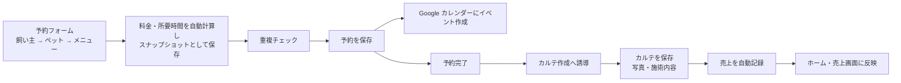
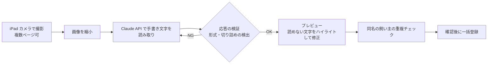

# Grooming Salon Manager — システム構成

README の構成図をもう一段詳しく説明します。店舗名・顧客データ・Firebase や OAuth の設定値は記載していません。

## 1. コンポーネント

| レイヤー | 役割 | 実装 |
|---|---|---|
| 画面 | ホーム、顧客一覧・詳細・登録、予約カレンダー（月/週/日）、予約フォーム、カルテ一覧・詳細・フォーム、売上一覧・詳細、設定（メニュー・料金・バックアップ・Google 連携・台帳読み取り） | React 19 + TypeScript、react-router、Tailwind CSS v4 |
| 共有 UI | ボタン・入力・カード・削除確認モーダルなどの共通コンポーネント | 独自の UI コンポーネント群 |
| データアクセス | Firestore の CRUD、クエリ、一括書き込み、利用者ごとのパス管理 | Firebase SDK（Firestore） |
| 認証 | Google ログイン（ポップアップ、失敗時はリダイレクト） | Firebase Authentication |
| オフライン | Firestore の永続ローカルキャッシュ、Service Worker によるアセットのキャッシュ | Firebase SDK、vite-plugin-pwa |
| 外部連携 | OAuth 認可、カレンダーのイベント操作、Drive へのバックアップ・復元 | Google Identity Services、Google Calendar API、Google Drive API |
| AI 読み取り | 台帳画像の縮小、Claude API への送信、応答の検証、重複チェック、一括登録 | Claude API |
| 移行 | 初期のローカル DB（IndexedDB）から Firestore への移行 | Dexie.js（残存） |

## 2. データモデル（概要）

| コレクション | 主な内容 | 備考 |
|---|---|---|
| 飼い主 | 氏名、連絡先、メモ | 検索対象 |
| ペット | 犬種、毛色、性別、体重、健康・医療情報、注意事項 | 飼い主に紐付く |
| 予約 | 日時、種別（トリミング / ホテル / セット）、メニュー、料金と所要時間のスナップショット、ステータス | Google カレンダーのイベント ID を保持 |
| カルテ | 使用薬剤、カットスタイル、皮膚の状態、申し送り、写真 | 予約に紐付く |
| 売上 | 金額、支払方法、メモ | カルテ作成時に自動記録 |
| メニュー・料金 | メニュー、犬種別料金、所要時間 | 変更しても過去データには波及しない |

すべてのコレクションは利用者（ログインしたアカウント）ごとのパスの下に置き、利用者間でデータが混ざらない構造にしています。
複数端末からは同じアカウントでログインし、クラウド上の同じデータを参照します。

## 3. 予約からカルテ・売上までの流れ

- 予約の変更・キャンセルはカレンダーのイベントにも反映する
- カルテ保存後の売上記録が失敗しても、カルテの保存とは分離し、再送信で重複が作られないようにしている

## 4. 紙台帳の AI 読み取り

- API 呼び出しにはリトライ・指数バックオフ・タイムアウトを設定
- 重複チェックが失敗しても読み取り結果を破棄せず、プレビューに進める

## 5. バックアップと復元

- データ変更時に Google Drive へ自動バックアップ、設定画面から手動バックアップと復元も可能
- 最大 5 世代を保持
- 復元は途中失敗でデータが消えない手順に改修済み。一括書き込みは件数上限に合わせて分割する
- OAuth トークンの失効を検出し、連携状態のバッジに反映する
- 端末内には JSON 形式の一括エクスポート機能もある

## 6. 品質確保の実態

| 手段 | 内容 |
|---|---|
| 型チェック | TypeScript（`tsc`）でエラー 0 件を維持 |
| 依存関係 | npm audit で重大な脆弱性 0 件 |
| 監査ワークフロー | 7 観点の並列監査 → 独立の検証役による突き合わせ → 完全性チェック。確定 54 件を高 7・中 19・低 11・要相談 8 に整理し、高 7 件・中 16 件・要相談 1 件を 27 コミットで修正（全コミットでビルドと型チェックを通過）。残りは方針決定待ちとして記録 |
| 実機確認 | iPad Safari（PWA）での動作確認を通過することを条件にしている |
| 自動テスト・CI | 未整備（今後の課題） |

## 7. 開発の記録

- コミット数 141（2026 年 3 月〜9 月）、ブランチは main のみ
- CLAUDE.md（プロジェクト情報、開発フェーズ、iPad 対応の注意点、権限ポリシー）、計画ファイル、教訓ファイル、監査レポート
- 教訓の例: 金額のスナップショット原則、編集時の既存値保持、新規フィールドへのクエリのフォールバック、実 DOM の確認、同一パターンの grep 全数確認、再送信の重複ガード
