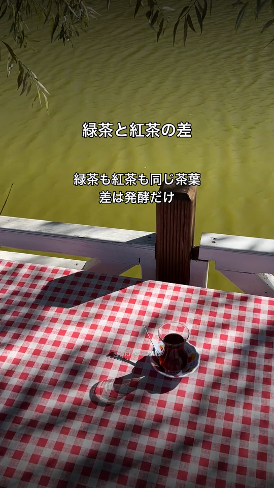
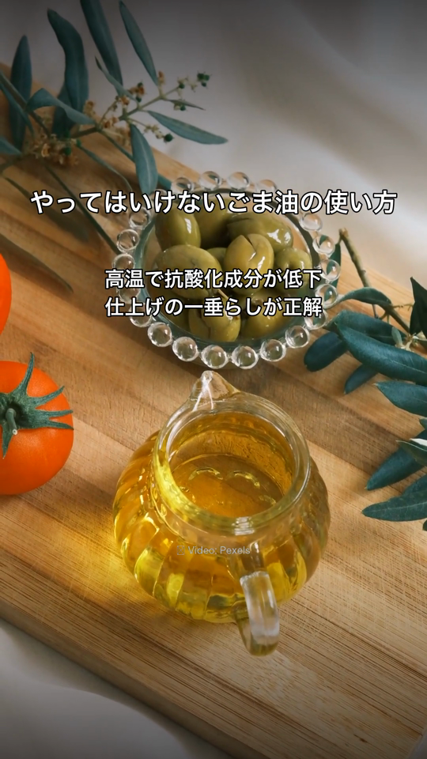
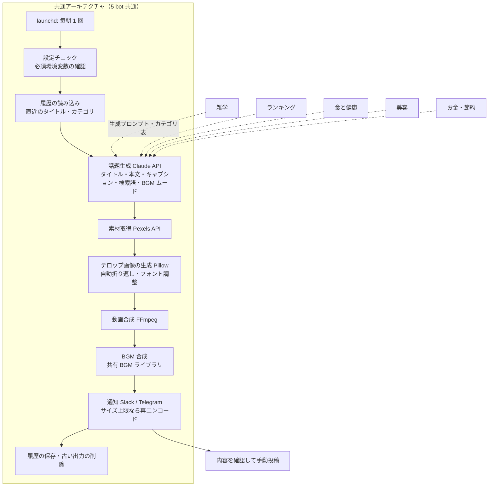

# Instagram Reel Bots

ジャンルの異なる 5 つの Instagram アカウント向けに、リール動画（縦型 30 秒）を毎日 1 本ずつ自動生成する bot 群です。
1 つの共通アーキテクチャをもとに 5 つの bot を運用し、生成された動画は通知を受けて内容を確認したうえで手動で投稿しています。

| 項目 | 内容 |
|---|---|
| 状態 | 運用中（2026 年 4 月開発開始、5 bot がそれぞれ毎朝 1 本生成） |
| 種別 | 動画自動生成 bot 群（Python / FFmpeg / Claude API） |
| 公開範囲 | 本ページは概要・構成・工夫点の説明のみ。ソースコード・アカウント情報は非公開 |

  
  

上の画像は実際に生成されたリール動画から切り出したフレームです（左: 雑学系、右: 食と健康系）。

## 1. 概要

雑学、ランキング、食と健康、美容、お金と節約の 5 ジャンルについて、それぞれ専用の Instagram アカウント向けに短い縦動画を毎日作るシステムです。
1 本の動画は「Claude API で話題とテロップ文を作る → 話題に合う縦動画素材を取得する → テロップを焼き込む → BGM を合成する」という流れで生成され、完成すると Slack と Telegram に動画とキャプションが届きます。

5 つの bot は別々のリポジトリですが、パイプラインの骨格・テロップ描画・BGM 合成・リトライ・履歴管理は共通の実装を持ち、ジャンルごとの違いは「話題の生成プロンプト」「カテゴリ表」「素材の検索語の作り方」に閉じ込めています。

## 2. 解決したかった課題

- ジャンルの異なる複数アカウントに毎日投稿するための動画制作を、人手を増やさずに続けたい
- 同じ話題・同じカテゴリが短期間に繰り返されないよう、機械的に重複を避けたい
- 日本語のテロップが不自然な位置で改行されたり、はみ出したりしないようにしたい
- 1 つの bot で改善した仕組み（BGM 合成、保持ポリシー、リトライ）を他の bot にも同じ品質で横展開したい
- 通知経路（Telegram）のファイルサイズ上限で動画が届かない、といった運用上の失敗を自動で回避したい

## 3. 主な機能（実装済み）

- **話題とキャプションの生成**: Claude API でジャンルに応じた話題（タイトル・本文）、キャプション、素材の検索キーワード、BGM のムード指定を生成する
- **重複排除**: 直近 60 日のタイトルと直近 21 日に使ったカテゴリを履歴から取得し、未使用のカテゴリを優先して出題する（全カテゴリを消化したら最も古いカテゴリに戻る）。各 bot は 10 カテゴリを持つ
- **切り口のローテーション**（雑学系）: 「推奨」「注意」「中立」の分類ごとに表現パターンを持つ切り口テンプレートをランダムに選び、同じカテゴリでも印象の違う話題になるようにする
- **素材取得**: Pexels API で話題に合う縦動画素材を検索・取得する。ジャンルごとに検索語の作り方を変えている
- **テロップの焼き込み**: Pillow でグラデーション背景付きのオーバーレイ画像を作り、FFmpeg で動画に合成する。タイトルの強調表示、本文の自動フォントサイズ調整、時間経過で本文が段階的に表示される構成に対応
- **日本語の自動折り返し**: 分かち書きライブラリ（budoux）で文節に分け、ピクセル幅を測りながら不自然な位置で改行しないように折り返す
- **BGM の自動合成**: 共有の BGM ライブラリからムード（明るい・落ち着いた・壮大・ミステリー・アップテンポ）に合う曲を選び、FFmpeg で合成する。使用した曲の履歴を bot 間で共有し、同じ日に別の bot が同じ曲を選ばないようにする
- **キャプションとハッシュタグ**: 内容に連動したハッシュタグを優先し、無ければ固定タグに戻す。ハッシュタグは 5 個に統一
- **通知**: Slack（Webhook）と Telegram（Bot API）の 2 経路に、動画・タイトル・キャプション・BGM 情報を送る
- **Telegram のサイズ上限対策**: 送信上限に近い動画は、ビットレートを段階的に下げて再エンコードしてから送る
- **定時実行**: launchd で各 bot が毎朝それぞれ異なる時刻に 1 回実行される
- **生成 → 通知 → 人が確認して投稿**: 自動化の範囲は生成と通知までとし、生成された動画は通知で内容を確認したうえで手動で投稿する
- **保持ポリシー**: 30 日を超えた動画・テキストは自動削除し、話題の履歴（JSON）だけを残す
- **起動時の設定チェック**: 必須の環境変数が不足していれば、不足一覧を通知して異常終了する

## 4. 技術スタック

| 分類 | 技術 |
|---|---|
| 言語 | Python 3.10+ |
| AI | Claude API（Anthropic）: 話題・キャプション・検索語・BGM ムードの生成 |
| 画像・動画処理 | Pillow（テロップ画像の生成）、FFmpeg（合成・エンコード・BGM ミックス） |
| 日本語処理 | budoux（分かち書き） |
| 素材 | Pexels API |
| 通知 | Slack Webhook、Telegram Bot API |
| 自動実行 | launchd（macOS） |
| 設定・履歴 | YAML（カテゴリ表）、JSON（生成履歴・話題履歴） |
| その他 | requests、PyYAML、python-dotenv、logging |

## 5. Claude Code の活用方法

- **1 つ目の bot を土台に 4 つの bot を派生**: 最初の bot（雑学系）を Claude Code と作り、その構成をもとにジャンル別の bot を派生させました。派生時は「共通部分はそのまま、ジャンル固有の生成プロンプトとカテゴリ表だけを差し替える」方針を依頼文で指定しています
- **共通モジュールの同一性を維持するルール**: リトライや BGM 合成のモジュールには「複数 bot で共通実装・内容の一致を維持すること」をファイル冒頭に明記し、修正時は全 bot へ同じ変更を展開するよう Claude Code に指示しています
- **改善の横展開**: 保持ポリシー、BGM 合成、Telegram のサイズ対策などは、1 つの bot で動作確認してから残りの bot へ「同一実装で移植」する依頼を出しています。コミット履歴にもその流れが残っています
- **依頼文のアーカイブ**: 機能追加・修正のたびに書いた依頼文（Markdown）をリポジトリ内に保存し、後から経緯を辿れるようにしています（3 つの bot で計 28 件）
- **各 bot の CLAUDE.md と作業記録**: 5 つのリポジトリすべてに CLAUDE.md（概要・技術スタック・運用前提・ディレクトリ構成・コーディング規約）と、計画・教訓の記録ファイルを置いています
- **運用前提の明記**: 「生成 → 通知 → 人が内容を確認して投稿」という運用前提を各 bot の CLAUDE.md に明記し、依頼のたびに説明し直さなくてよいようにしています
- **動作確認の方法**: 手動の検証スクリプト（dry-run 起動と生成物の確認）で動作を確認しており、自動テストは今後の課題です

## 6. システム構成

詳細は [docs/architecture.md](docs/architecture.md) を参照してください。

## 7. 開発で工夫した点

- **ジャンル差分の閉じ込め**: 5 つの bot で異なるのは「話題の生成プロンプト」「カテゴリ表」「検索語の作り方」だけになるように分け、パイプライン本体・テロップ描画・BGM 合成・リトライ・履歴管理は共通実装にしました
- **共通モジュールの一致を保つ運用**: 共通モジュールの冒頭に「複数 bot で同一実装を維持する」旨を書き、変更時は全 bot へ同じ内容を展開しています。実際に BGM 合成モジュールは 5 bot で内容が完全に一致しています
- **日本語テロップの折り返し**: 文字数ではなく、分かち書きした文節ごとにピクセル幅を測って折り返すことで、「読みにくい位置での改行」と「はみ出し」を同時に防いでいます
- **重複排除の 2 段構え**: タイトル単位（60 日）とカテゴリ単位（21 日）の履歴を分け、カテゴリを一巡させながら同じ話題を避けています
- **BGM 合成は失敗しても止めない**: BGM 合成はどんな失敗でも例外を投げず「合成なし」として続行する設計にし、BGM の不具合で毎朝の生成が止まらないようにしました
- **通知経路の制約への自動対応**: Telegram の送信上限に対し、上限付近で段階的に再エンコードして送る処理を入れ、送信失敗を恒久的に解消しました
- **外部 API 呼び出しの保護**: Claude API と Pexels API の呼び出しを共通のリトライヘルパー（最大 3 回・指数バックオフ）で包み、例外だけでなく「結果が空」の場合も失敗として扱います
- **出力の保持ポリシー**: 動画ファイルは 30 日で自動削除しつつ、話題の履歴は残す設計にして、ディスク使用量と重複排除を両立しました

## 8. Demo

🎥 YouTube Demo

[デモ動画を見る](https://www.youtube.com/)（URL は後で追加）

## 9. このプロジェクトで得たこと

- 1 つの仕組みを複数のジャンルへ横展開するときに、「どこまでを共通にし、どこをジャンル固有にするか」を先に決めておくことの重要性
- 共通実装の一致を保つルールを文書とコードの両方に書き、Claude Code への依頼でも「全 bot に同一の変更を展開する」と明示する運用
- 「失敗しても本流を止めない処理」と「失敗したら止める処理」を切り分ける判断（BGM は前者、必須設定の不足は後者）
- 日本語の見た目（改行位置・フォントサイズ）は自動生成の品質を大きく左右するため、専用の処理に投資する価値があること
- 自動化の範囲を運用の実態に合わせて「生成まで」に絞り、投稿前に人が確認する工程を残す判断
