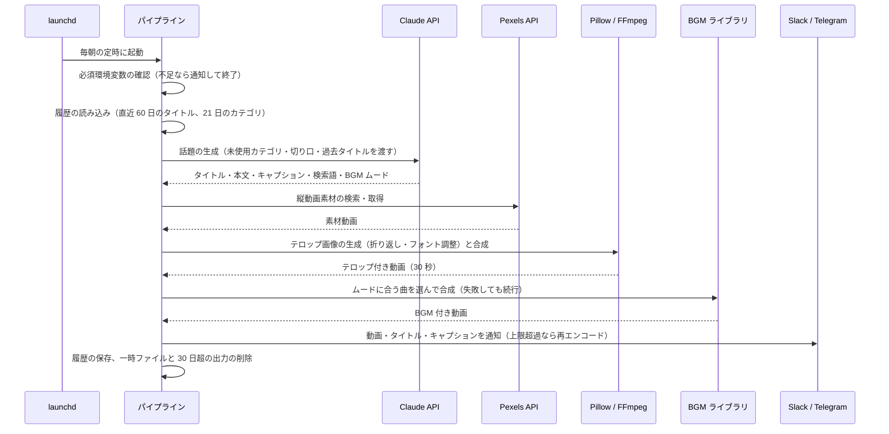

# Instagram Reel Bots — システム構成

README の構成図をもう一段詳しく説明します。アカウント名・通知先・認証情報などの実設定値は記載していません。

## 1. リポジトリ構成の考え方

| 区分 | 内容 | 5 bot での扱い |
|---|---|---|
| パイプライン本体 | 起動・設定チェック・各ステップの呼び出し・通知・後片付け | 同じ骨格。ジャンル固有の生成器の呼び出し部分だけが異なる |
| 話題の生成器 | Claude API へのプロンプト、出力 JSON の検証 | ジャンルごとに専用モジュール |
| カテゴリ表 | 10 カテゴリの定義（YAML） | ジャンルごとに内容が異なる |
| 素材の検索語 | 話題から Pexels の検索クエリを組み立てる | ジャンルごとに調整 |
| テロップ描画 | Pillow によるオーバーレイ生成、FFmpeg 合成 | 共通（微調整あり） |
| BGM 合成 | 共有ライブラリからの選曲と合成 | 共通（内容が完全一致） |
| リトライ | 指数バックオフ付きの共通ヘルパー | 共通（一部の bot は本体に内包） |
| 履歴管理 | 生成履歴 JSON の走査、未使用カテゴリの選択 | 共通仕様 |
| 通知 | Slack Webhook、Telegram Bot API | 共通（文面は bot ごと） |

最初の bot（雑学系）をコピーして派生させる方式を採っており、共通ライブラリとしてパッケージ化はしていません。
そのかわり、共通モジュールには「複数 bot で同一実装を維持する」旨を明記し、変更時に全 bot へ展開する運用にしています。

## 2. 1 回の生成の流れ

## 3. 重複排除と話題の多様化

| 仕組み | 内容 |
|---|---|
| タイトル履歴 | 直近 60 日のタイトルを生成プロンプトに渡し、同じ話題を避ける |
| カテゴリのローテーション | 直近 21 日に使ったカテゴリを除外し、未使用カテゴリを優先。全カテゴリを消化したら最も古いものへ戻る |
| 切り口テンプレート（雑学系） | 「推奨」「注意」「中立」の分類ごとに表現パターンを持ち、毎回ランダムに 1 つ選ぶ。推奨と注意が矛盾するタイトルを防ぐ |
| BGM の履歴 | 使用した曲の履歴を bot 間で共有し、同じ日に別の bot が同じ曲を選ばないようにする |

## 4. テロップ描画

- 話題のタイトルと本文から、グラデーション背景付きのオーバーレイ画像を Pillow で生成する
- タイトルは強調色で一部を目立たせ、幅に収まるよう自動で折り返す
- 本文は上限の高さに収まるまでフォントサイズを自動で調整する
- 折り返しは budoux で文節に分けたうえで、文節ごとのピクセル幅を測って行を組む
- 絵文字など描画できない文字は事前に取り除く
- FFmpeg で素材動画に合成する。本文が時間経過で段階的に現れる構成にも対応

## 5. 失敗時の扱い

| 状況 | 挙動 |
|---|---|
| 必須環境変数の不足 | 不足一覧を通知して異常終了（fail-close） |
| Claude API / Pexels API の一時的な失敗、出力 JSON の検証失敗 | 最大 3 回、指数バックオフでリトライ |
| BGM 合成の失敗 | 例外を出さず「合成なし」で続行（fail-open）。通知に BGM なしの旨を含める |
| Telegram の送信上限超過 | 上限付近で段階的にビットレートを下げて再エンコードし、再送 |
| Telegram 送信の一時的な失敗 | 最大 3 回リトライ |
| 実行全体の失敗 | Slack にエラー通知、ログに記録 |

## 6. 運用

- launchd で各 bot を毎朝異なる時刻に 1 回実行する
- 自動化の範囲は生成と通知まで。生成された動画は通知で内容を確認したうえで手動で投稿する
- 出力ディレクトリの動画・テキストは 30 日で自動削除し、履歴 JSON のみ残す
- 実行ログは logging 標準ライブラリで launchd の標準出力・標準エラーに書き出す
- 環境ファイル（API キー、通知先）は Git 管理外。リポジトリには変数名だけを書いたサンプルを置く

## 7. 開発の記録

- 5 リポジトリすべてに CLAUDE.md、計画ファイル、教訓ファイルを配置
- 依頼文（Markdown）を 3 つのリポジトリで計 28 件アーカイブ
- コミット数は bot ごとに 34〜54 件（2026 年 4 月〜9 月）
- 動作確認は手動の検証スクリプト（dry-run 起動と生成物の確認）と実行ログで行っており、自動テストは今後の課題
