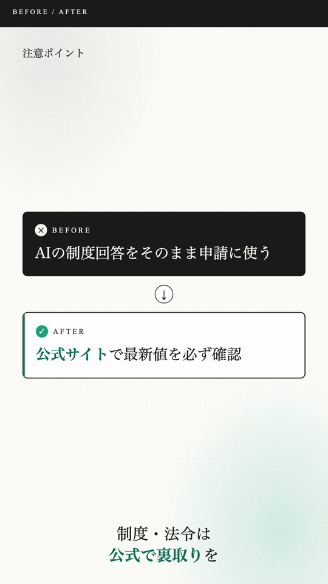
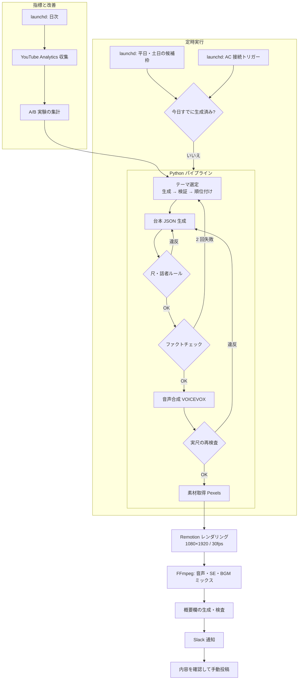

# YouTube Shorts Automation

テーマ選定から台本生成・事実確認・音声合成・レンダリングまでを毎日自動で行う、縦動画（YouTube Shorts）の生成パイプラインです。
手元の Mac で定時実行し、生成された動画を確認したうえで YouTube へは手動で投稿しています。

| 項目 | 内容 |
|---|---|
| 状態 | 運用中（2026 年 4 月開発開始、定時実行で毎日 1 本生成） |
| 種別 | 動画自動生成 bot（Remotion / Python / TypeScript） |
| 公開範囲 | 本ページは概要・構成・工夫点の説明のみ。ソースコードは非公開 |

  
  

上の画像は実際に生成された動画から切り出したフレームです（左: 冒頭のフック画面、右: NG/OK カード）。

## 1. 概要

AI ツールの使い方、お金の失敗回避、学習・健康のコツといった「生活や仕事に役立つ小ネタ」をテーマに、1 本 30 秒前後の縦動画を毎日作るシステムです。
人がやると、テーマを決め、台本を書き、事実を確かめ、ナレーションを入れ、画面を作って書き出す、という作業が毎日必要になります。
このプロジェクトでは、その流れを AI（Claude API）とレンダリングエンジン（Remotion）でつなぎ、決まった時刻に自動で動画が出来上がる状態にしました。

一方で、AI が作った台本をそのまま出すのではなく、事実確認・長さの検査・表現の検査を通し、通らなければ作り直すか別のテーマに切り替える仕組みを入れています。
できあがった動画は Slack に届き、内容を確認してから投稿します。

## 2. 解決したかった課題

- 毎日 1 本の動画を作り続ける制作コストを、人の作業時間を増やさずに賄いたい
- AI が生成する台本に含まれる事実誤り・根拠のない数値・不自然な断定を、公開前に機械的に弾きたい
- 動画の長さが上限を超えたり、話者の切り替えが不自然になったりする問題を、人が毎回チェックしなくても防ぎたい
- 同じ構成・同じ素材・同じテーマの使い回しを避け、飽きられにくいローテーションを自動で回したい
- どの構成やタイトルの型が視聴されるのかを、感覚ではなく指標で比較したい
- ノート PC で運用するため、バッテリー駆動やスリープによる実行失敗を減らしたい

## 3. 主な機能（実装済み）

- **テーマの自動選定**: 候補生成 → 検証 → 順位付けの 3 段階を Claude API で行い、直近の出題履歴と重複しないテーマを選ぶ。候補プールとフォールバックを持つ
- **台本（シーン設計 JSON）の生成**: シーンごとの字幕・話者・画面種別・素材の検索語を含む JSON を生成する
- **ファクトチェック**: 生成した台本を別のプロンプトで事実確認し、2 回失敗したら次点のテーマへ切り替える
- **根拠のない数値主張の検出**: 「○倍」「○%削減」のような比較効果の主張を正規表現で検出するガード（フラグで段階的に導入中）
- **尺と話者ルールの検査・再生成**: 合計時間と話者の切り替えルールを検査し、違反があれば修正指示を付けて再生成する。音声合成後の実尺でも再検査する
- **素材取得**: Pexels API で縦動画素材を取得。不適切な素材を避ける NG タグの絞り込みと、同じ素材を短期間に使い回さないクールダウンを持つ
- **音声合成**: VOICEVOX（ローカル）で 2 話者のナレーションを生成
- **レンダリング**: Remotion（React）で 1080×1920 / 30fps の動画を描画。フック画面と 5 種類のカード（比較・手順・NG/OK・まとめ・事実）、Spring アニメーション、デザイントークンによる統一配色
- **音声・効果音・BGM のミックス**: FFmpeg で話者間の間を調整し、効果音と BGM を合成してラウドネスを正規化する
- **概要欄の生成と検査**: 投稿用の説明文を生成し、別プロンプトで検査する
- **ローテーション管理**: 構成・エンディング・タイトルの型を履歴で管理し、直近と同じものを避ける
- **定時実行**: launchd で 1 日 1 回生成（平日と土日で異なる時間帯の候補枠を持ち、成功したら同日の残り枠をスキップ）。バッテリー駆動中は開始せず、AC 接続をトリガーにした再実行にも対応
- **指標の収集**: YouTube Analytics API で再生・視聴維持などの指標を毎日取得し、動画ごとに記録
- **A/B テストの枠組み**: 投稿順・構成・テーマ・CTA の型などを「スロット」として割り当て、指標を比較して改善を判断する実験フレームワーク
- **通知**: 生成完了・失敗・警告を Slack に通知（概要欄もそのまま貼れる形で添付）

## 4. 技術スタック

| 分類 | 技術 |
|---|---|
| 動画レンダリング | Remotion 4、React 18、TypeScript 5 |
| パイプライン | Python 3、unittest |
| AI | Claude API（Anthropic）: テーマ選定・台本生成・ファクトチェック・概要欄生成 |
| 素材・音声 | Pexels API、VOICEVOX ENGINE（ローカル） |
| メディア処理 | FFmpeg / ffprobe（音声ミックス、ラウドネス正規化、尺の計測） |
| 指標 | YouTube Analytics API（OAuth） |
| 自動実行 | launchd（macOS）、シェルスクリプト |
| 通知 | Slack API |
| 設定・状態 | YAML / JSON（テーマプール、履歴、実験計画） |

## 5. Claude Code の活用方法

このプロジェクトは、既存の PIL + FFmpeg 版から Remotion 版へ作り直したものです。移行の設計から実装、テスト、運用改善まで、ほぼすべての工程で Claude Code を使っています。

- **CLAUDE.md にプロジェクトの前提を集約**: アーキテクチャ図、シーン設計 JSON のスキーマ、設計判断（ローテーション方式、音声ミックスの順序など）、開発時の注意点（ライブラリの落とし穴）、launchd の運用ルール（実行中に触ってはいけない設定）を記載し、毎回の依頼で前提を説明し直さなくてよい状態にしています
- **フェーズ分割の依頼と承認**: 大きな変更は「調査 → 計画提示 → 承認 → 実装 → テスト → 報告」に分け、区切りごとに内容を確認してから進めています。計画・チェックリストの記録は 1,400 行を超えています
- **教訓ファイルの運用**: 障害や設計ミスが起きるたびに「何が起きたか・根本原因・再発防止ルール」を記録し、古いものはアーカイブ節へ移動しています
- **仕様変更ログ**: A/B テスト期間中は仕様を凍結し、例外的な変更は必ず変更ログに記録するルールを CLAUDE.md に明記しています
- **インシデント報告書の作成**: 生成失敗の障害では、ログの時系列整理・原因分析・対策を Claude Code とまとめた報告書を残しています
- **テストの整備**: 尺検査・ファクトチェックのガード順序・実験計画・失敗台本の保存など 19 ファイルの単体テストを Claude Code と作成し、変更のたびに実行しています
- **プロンプトのバージョン管理**: Claude API 向けのプロンプト（テーマ生成・検証・順位付け、台本生成、ファクトチェック、概要欄生成・検査）をファイルとして Git 管理しています

## 6. システム構成

詳細は [docs/architecture.md](docs/architecture.md) を参照してください。

## 7. 開発で工夫した点

- **fail-open と fail-close を使い分ける設計原則**: 当初、尺の超過は警告のみで続行していました。公開後は取り消せないことを踏まえ、「下流が不可逆な工程ほど失敗で止める（fail-close）」という原則を教訓として明文化し、尺検査を fail-close に変更しました
- **多段の AI 検証**: 台本生成の後に、ルール検査（尺・話者）、ファクトチェック、数値主張ガードを別々のステップとして置き、1 つのプロンプトの出力を信用しない構成にしています。ファクトチェックに繰り返し失敗したテーマは、粘らずに次点へ切り替えます
- **失敗した台本を捨てずに残す**: 検査で弾かれた台本を保存し、どの検査がどの理由で落としたかを後から分析できるようにしました（「捨てる前に記録する」をルール化）
- **ノート PC 運用への対策**: バッテリー駆動中は生成を開始しない、レンダリング中はスリープを抑止する、実行前にネットワーク到達性を待つ、AC 接続をトリガーに再実行する、といった対策を launchd と補助スクリプトで実装しました
- **日本語の禁則処理と分かち書き**: 字幕の改行で複合語が不自然に分かれる問題に対し、分かち書きと禁則処理を自前のユーティリティとして実装しました
- **A/B テストの枠組み**: 実験の割り当てをスロット（投稿順・構成・テーマ・CTA の型）として状態管理し、生成の成否も含めて記録することで、指標の比較を再現可能にしました
- **テスト事故からの再発防止**: テストが実ファイルを書き換えてしまう事故が起き、原因（モックが効かないタイミングの問題）を特定してテスト設計を修正し、教訓として記録しました
- **再配布できない素材の管理**: BGM などライセンス上コミットできない素材は Git 管理から外し、配置先と扱いをルール化しています

## 8. Demo

運用中のチャンネル・アカウントの URL は、本リポジトリでは非公開としています。生成された動画のフレームは上記スクリーンショットを参照してください。

## 9. このプロジェクトで得たこと

- AI の生成結果を「そのまま使う」のではなく、「検査して通ったものだけ使う」パイプラインを設計・運用する経験
- 毎日動く自動化を運用する中で、電源・スリープ・ネットワークといった実行環境の問題が品質に直結することを学び、対策を積み上げたこと
- 障害や設計ミスを教訓として記録し、fail-open / fail-close のような判断基準にまで一般化する習慣
- 指標を取りながら仮説を検証する A/B テストの枠組みを、個人開発でも回せるように設計したこと
- Claude Code に対して「CLAUDE.md・依頼文・教訓・仕様変更ログ」でルールを積み上げると、長期の開発でも一貫した実装が得られること
