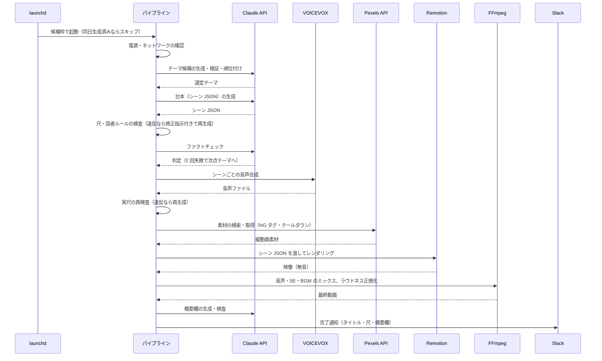

# YouTube Shorts Automation — システム構成

README の構成図をもう一段詳しく説明します。実際の設定値・認証情報・チャンネル情報は記載していません。

## 1. コンポーネント

| レイヤー | 役割 | 実装 |
|---|---|---|
| 定時実行 | 生成ジョブの起動、同日の重複実行の防止、電源・ネットワーク状態のゲート | launchd（3 ジョブ）＋シェルスクリプト |
| オーケストレーション | 各ステップの呼び出し、検査と再生成のループ、通知 | Python（パイプライン本体） |
| テーマ選定 | 候補生成 → 検証 → 順位付け、出題履歴との重複回避、候補プールへのフォールバック | Python ＋ Claude API ＋ YAML（プール・履歴） |
| 台本生成 | シーン設計 JSON の生成（字幕・話者・画面種別・素材検索語） | Python ＋ Claude API ＋ プロンプトファイル |
| 検査 | 尺・話者ルール、ファクトチェック、数値主張ガード | Python（ルール検査は正規表現とスキーマ検証、事実確認は Claude API） |
| 素材 | 縦動画素材の検索・取得、NG タグの絞り込み、使用履歴によるクールダウン | Python ＋ Pexels API ＋ JSON（使用履歴） |
| 音声 | 2 話者のナレーション生成、実尺の計測 | VOICEVOX ENGINE（ローカル HTTP）＋ ffprobe |
| レンダリング | シーン JSON を受け取って動画を描画 | Remotion（React / TypeScript）、Remotion CLI |
| ミックス | ナレーション・効果音・BGM の合成、話者間の間の調整、ラウドネス正規化 | FFmpeg |
| 概要欄 | 投稿用の説明文の生成と検査 | Python ＋ Claude API |
| 通知 | 完了・失敗・警告の通知、概要欄の添付 | Slack API |
| 指標 | 再生数・視聴維持などの日次取得、動画ごとの記録 | Python ＋ YouTube Analytics API（OAuth）＋ JSON |
| 実験 | A/B テストのスロット割り当てと集計 | Python ＋ JSON（実験計画）＋ 集計スクリプト |

## 2. 1 回の生成の流れ

## 3. 品質ゲート

| ゲート | 検査内容 | 失敗時の挙動 |
|---|---|---|
| 尺・話者ルール | 合計時間の上限、シーン数、話者の切り替えパターン | 違反内容を修正指示として付け、上限回数まで再生成 |
| ファクトチェック | 台本の事実誤り・不適切な断定 | 断定表現の機械的な緩和 → それでも失敗なら再生成 → 2 回失敗でテーマを次点へ切り替え |
| 数値主張ガード | 根拠のない倍率・削減率などの比較効果 | 検出時は再生成（フラグで段階導入中） |
| 実尺の再検査 | 音声合成後の実際の長さ | 違反なら台本から再生成（fail-close） |
| 素材フィルタ | NG タグ、直近に使った素材 | 候補を絞り込み、全滅なら基本の NG だけで再検索 |
| 概要欄の検査 | 説明文の内容 | 生成できない場合は手入力を促す通知 |

検査で弾かれた台本は削除せず保存し、どのゲートがどの理由で落としたかを後から分析できるようにしています。

## 4. 定時実行と実行環境

| ジョブ | 役割 | 備考 |
|---|---|---|
| 生成ジョブ | 平日と土日で異なる時間帯の候補枠を持ち、1 日 1 回だけ生成する | 成功時に「本日生成済み」の印を残し、同日の残り枠はスキップ |
| 電源トリガー | バッテリー → AC 接続の遷移を監視し、その日まだ生成していなければ起動する | 常駐の監視スクリプト。日中の時間帯のみ有効 |
| 指標収集 | 毎日決まった時刻に YouTube Analytics から指標を取得する | OAuth の認証ファイルはリポジトリ外に保管 |

実行環境の対策:

- バッテリー駆動中は生成を開始しない（AC ゲート）
- レンダリング中はスリープを抑止し、電源状態を記録に残す
- 実行前にネットワーク到達性を待つ
- レンダリングのタイムアウトを実測に合わせて調整

## 5. 状態と履歴の管理

| データ | 用途 | 管理 |
|---|---|---|
| テーマプール・出題履歴 | 候補の供給と重複回避 | YAML、Git 管理 |
| 構成・エンディング・タイトルの履歴 | ローテーション | YAML |
| 素材の使用履歴 | クールダウン | JSON |
| 実験計画 | スロットの割り当てと状態（未実施 / 実施済み / 無効 / 有効） | JSON、スナップショットを記録 |
| 動画ごとの記録 | 生成条件・尺・実験の割り当て・指標の紐付け | JSON、Git 管理外 |
| 指標 | 日次で取得した指標 | JSON、Git 管理外 |
| 失敗台本 | 検査で弾かれた台本と理由 | JSON、Git 管理外 |
| 生成物 | 最終動画、Remotion に渡した JSON のスナップショット | Git 管理外 |

## 6. A/B テストの枠組み

- 投稿順・構成・テーマの系統・CTA の型などの因子を「スロット」に割り当て、実験計画として JSON に持ちます
- 各スロットは「未実施 → 実施済み → 有効 / 無効」の状態を持ち、生成の成否も記録します
- 指標収集で取得した値をスロットに紐付け、集計スクリプトで比較します
- 実験期間中は仕様を凍結し、例外的な変更は変更ログに記録します
- 実験の結果を受けて、テーマの配分・タイトルの型・検査ルールを次のフェーズで調整します

## 7. テストと運用記録

- 単体テスト（unittest、19 ファイル）: 尺の fail-close、ファクトチェックのガード順序、実験計画、失敗台本の保存、数値主張ガード、電源状態、前日分の実行判定、通常モードの回帰など
- 教訓ファイル: 障害・設計ミスの根本原因と再発防止ルールを時系列で記録
- 仕様変更ログ: 実験期間中の変更を記録
- インシデント報告書: 生成失敗の障害について、時系列・原因・対策を文書化
